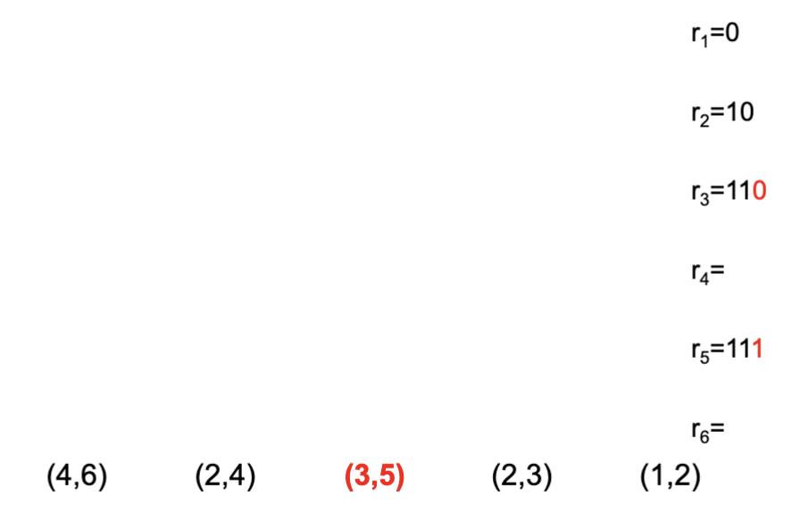

# Topic 1: Digital Image Fundamentals

## Image

- Image is a representation of the visual information in a given object or scene
- Describe the information represented in each image

### Image Composition

- An Image is composed of discrete units called picture elements, or, pixels
- Each pixel occupies a small rectangular region of the image and displays **one** color at a time
- pixels are arranged so that they form a two-dimensional array
- Images are constructed by adjusting the color of individual pixels
- Each pixel has 256 colors
- Number of different images can be generated given the size of the image
  - Number of possible colors per pixel ^ Number of pixels

Image Formats

- **bitmap format**
  - represented as a two-dimensional array, where each array-element represents a single color to be displayed at a specific location
  - each element is generally mapped to a single pixel in the monitor
  - **Size Dependent**
    - reducing the size requires throwing away information
    - enlarging the size produces blocking artifacts
  - **Pros**
    - Can produce a very high quality real-scene images
  - Cons:
    - the amount of data required to hold them
    - size dependent
    - not suitable for editing
- **Vector format**
  - a descriptive representation
  - consists of a series of drawing commands to represent an image
  - monitors can not directly deal with vector commands
  - **Pros**
    - small in size
    - size independent
    - suitable for editing
  - **Cons**
    - not suitable for reproducing photographs or paintings

## Digitization

- the process of converting an analog signal to a digital signal
- a digitizing device (scanners) is an instrument that creates a digital version (a bitmap version) of a physical representation, by approximating the color of each pixel

## Resolution Versus Density

### Resolution

- a measure of details describes the amount of pixel information regardless of its size
- the resolution of an image is its physical size in pixels
  - number of pixel wide * number of scan lines long
- the resolution of a monitor is the number of pixels per a scan line * the number of scan lines it may display
- a TV's size refers to its diagonal length in inches

### Density

- the quantity per unit describes the amount of detail on a physical surface or device
- pixel density is number of dots, or pixels, per unit length
- the pixel density of reasonable quality laser printers is 1200 dots per inch (dpi)

## Jagging

- the pixels may have jagged edges, which is not pleasing to human eyes
- the more densely pixels are packed together:
  - the less noticeable the jagged edge becomes
  - the more storage space is required to save
  - the more time to transmit the image (more cost)

## Pixel Depth

- pixel depth is the number of bits used to form individual pixel values
- 2^Pixel_Depth specifies the maximum number of different values a pixel can assume
  - for 8 bits per pixel (bpp), 2^8=256 is the max number of different values a pixel can assume

## Bit Plane

- a two-dimensional array of bits, one bit deep
- an 8 bpp bitmap image contains 8 bit planes
- a binary image has a single bit plane

## Image Display

### Computer Monitors

- 100 pixels per inch
- each monitor controller has its own memory
- each pixel on the monitor has a corresponding memory location in this memory
- the monitor controller converts the values in the memory to a color that can be displayed by the monitor

### Computer Printers

- much higher density than a computer monitor has
- printers do contain memory
- data is transmitted over a serial cable
- image built -> printer's memory -> get written to the printer page

### Frame

- single image == single frame
- moving sequence
  - multiple frames of slightly differing images displayed in rapid sequence may provide the illusion of continuous motion
  - cartoon animation: 12 to 15 frames per seconds
  - video animation: 24 frames per second

## Color components in images

- images can be
  - Binary
    - each pixel displays one of two colors (black and white)
  - Gray
    - each pixel displays one shade of gray
  - Color
    - each pixel displays one multiple-color value

week 2

## Image Acquisition

- image acquisition process is very similar to how we see things

  - illuminating the scene with an energy source
  - recording the reflected energy using sensors
- A digital sensor can only return a discrete set of energy levels

### Digitization

- **Digitization** (quantization) is the process of converting a continuous analogue signal into a digital representation of this signal
  - at the end, we get numbers, not colorsy
  - image viewers convert these numbers into color before displaying them
  - a digital image is always an approximation of a real-world scene

### Color Image

- Using three **filters** that are sensitive to red, green, and blue
- Using three **sensors** to measure the intensity of the output of each filter
- the results are three **monochrome** images
  - the intensities of each image are proportional to the responses of one of the filters

### Electromagnetic waves

- for humans, the energy source is the visible light, which is a kind of electromagnetic wave
- based on the wavelength of the energy source used, we get various image modalities
- for each electromagnetic waves, we need a special sensor to record and quantize reflected energy
  - human can not see any electromagnetic waves, other than the visible spectrum
- Speed = Wavelength * Frequency
  - high frequencies (reder) mean
    - shorter wavelengths
    - more details
      - a wave can not capture details smaller than its length
    - less penetration

## Color Models

- Color model
  - a system for representing colors
  - RGB, YCC, CMYK, HSI

### RGB Color Model

- colors are composed of three components that represent the intensities of red, green, and blue
- an **additive** system in which varying amounts of red, green, and blue colors are added to black color to produce a new color
- each pixel represents as a color triplet
  - three numberical values in the form (red, green, blue)
- in 24-RGB color
  - (0, 0, 0) represents black
  - (255, 255, 255) represents white
- Total number of colors = R * G * B

### YCbCr Color Model

- additive color system, similar to the one used in television set that allows color images to be compatible with black and white sets
- the Y component represents the intensity of the image

  - it is called the luminance component
- Cb and Cr components specify the blueness and redness of the image

  - they are called chrominance components
  - The green component doesn’t have its own channel in YCbCr — it’s embedded inside the luminance and derived mathematically from the other two chroma channels.
  - $G = Y - 0.344136 \cdot Cb - 0.714136 \cdot Cr$
- **Conversion between RGB and YCbCr spaces, using linear transformations**

  - 
- Range: (0, 128, 128) - (255, 128, 128)
- Green is negative

  - a correction term to prevent double-counting green, since Y is dominated by the green contribution.

### CMYK

- a subtractive color system
  - usually used on a white surface
- Cyan, Magenta, Yellow filers absorb their complementary light color
  - Cyan absorbs red
  - Magenta absorbs green
  - Yellow absorbs blue
- When Cyan, Magenta, and Yellow filters are combines, they absorb all light, resulting in black
- Black color is added onto the color system and treated like an independent primary color variable
  - Black filter absorb all light
- **CMYK <-> RGB Conversion**
  - $C = 1-(R/255), M = 1-(G/255), Y=1-(B/255)$
  - $R=(1-C)*255, G=(1-M)*255, B=(1-Y)*255$

### HSI Color Model

- Hue-Saturation-Intensity is a cylindrical-coordinate representation of points in an RGB cartesian-coordinate
- **hue** describes the pure color attribute, represented by the cylindrical angle
  - start at the red at 0°
  - passing through the yellow at 60°
  - the green at 120°
  - the cyan at 180°
  - the blue at 240°
  - the magenta at 300°
  - wrapping back to red 360°
- **saturation** measures the amount of a pure color dilution 稀释 by white, represented by the cylindrical radius (inverse relation)
  - ranges from 0 when having a pure gray shade (at the center)
  - ranges to 1 when having maximum color (at the circumference)
- **intensity** (the central vertical axis) represents the neutral gray colors
  - ranges from black at value 0 at the bottom
  - ranges to white at value 1 at the top
- **Relationship between RGB and HSI models**
  - 
  - Vertical = intensity (black → white)
  - Around the middle = hue (red, yellow, green, cyan, blue, magenta)
  - Distance from center = saturation
- **Conversion from RGB to HSI**
  - 
  - 

### Gray-Scale

- some display devices can not display colors at all, but rather shades of gray
- shade of gray can be represented by a single component
- in RGB, the shades of gray occur when R = G = B
- obtain of gray-scale version
  - use the G component from the RGB model
  - use the Y component from the YCbCr model (more accurate)

### True-Color versus Color-Palette

- true color system
  - any system which is capable of matching, or exceeding, the color resolving power of the human eye under most conditions
  - means 24 bpp (bits per pixel)
- Color-paletter (color map, index map, color table, look-up table)
  - one-dimensional array of 3-byte elements that specify the color
  - using a color-palette, data in a file can be stored as a series of color index values, rather than directly specifying the true-color
  - the most common size for a color-palette is 256 entries
    - each pixel index value consists of 8 bits

### Byte Ordering and Bit Ordering

- all bitmap image files contain integers stored in a binary format
- for single-byte integers (characters), there is no compatibility problem among different processor types
- Multi-byte integers:
  - Big-endian
    - the most significant integer byte is stored first
    - big, most significant byte, stored first
  - Little-endian
    - the least significant integer byte is stored first
    - little, least significant byte, stored first

---

week 3

# PNM: PBM, PGM, and PPM

### In PBM, PGM, PPM image formats - PNM (Portable aNy MAP)

- An image = an image header + image data

  - Header
    - Image header always written in ASCII text
    - Header values are separated by white spaces
      - Tab, < CR >, SPACE
      - any characters coming just after a '#' character till the next < CR > are comments
  - Image Data
    - comes directly after the last header field (that followed by < CR >)
    - is a series of values describing image pixels in bitmap format
    - the bitmap pixels:
      - start at the top-left corner of the image
      - proceed from left to right, and from top to bottom, in a raster scan fashion
    - data format: ASCII - values are separated by white spaces
    - data format: Raw - values are stored without any white space between them
- In any PNM raw format: P4, P5 P6

  - the binary pixel values start immediately after the < CR > of the last line in the header
  - no white space or comment is allowed
    - in the image data section
    - between the header and pixel value section
- To convert a PNM image to

  - postscript - use 'pnmtops' unix command
  - tiff - 'pnmtotiff'
- to debug a PNM binary file, use 'od -cx'

## PBM - Portable Bit Map

### PBM header

- consists of 3 fields
  - magic value (file identifier value) - the first two bytes of the header
    - P1 for ASCII pixel values
    - P4 for raw pixel values
  - Image width - ASCII decimal value
  - Image height - ASCII decimal value

### PBM Data part

- 1 means black; 0 means white
- any number other than 0 or 1 in the pixel values area is not acceptable
  - image data must be binary values
- the white spaces between pixel values are optional and can be omitted
- In case of P4 RAW (binary)
  - each image row must be stored as raw bits in
    - eight pixels per byte (MSB first)
  - no two rows share the same byte
    - the rest of the last byte of each row to be filled by zeros
  - no white space or comment is allowed in the image data part; after all, the image data part is no longer ASCII text to have comments
    - because it will be interpreted as a char
    - from 129 to 255 - 8 bits

## PGM - Portable Gray Map

### PGM Header

- consists of 4 fields
  - magic value (2 bytes): P2 for ASCII pixel values; P5 for raw pixel values
  - imgae width: ASCII decimal value
  - image height: ASCII decimal value
  - maximum gray value: ASCII decimal value
    - must be less than 65536 and more than 0
    - will affect the number of bytes per pixel in raw format

### PGM Data

- 0 means black; maximum gray value means white
- any pixel value greater than the maximum gray value will likely be interpreted as 0
- if P5 RAW, image data must be stored as raw bits in one byte (or two bytes) per pixel; the maximum gray value decides one or two bytes per pixel

## PPM - Portable Pixel Map

### PPM Header

- 4 fields
  - magic value: P3 for ASCII; P6 for raw
  - image width: ASCII
  - image height
  - maximum color value: ASCII decimal value
    - must be less than 65536 and more than zero
    - will affect the number of bytes per pixel in raw format

### PPM data

- 0 means black
- maximum color value in all three pixels means white
- any pixel value greater than the maximum color value will likely be interpreted as 0
- if P6 is selected, image data must be stored as raw bits in three bytes (or six bytes) per pixel (red, green, blue)
  - the maximum color value decides three or six bytes per pixel

# Compression

- A process intended to yield a compact representation of a given object
- the object of image compression is to achieve a low bit rate in the digital representation of an input image
  - compact digital image representation with no or at most minimal perceived loss of picture quality
- Image communication applications
- image retrieval applications
- remote sensing applications

## Data vs. Information

- Data and information are not synonymous
  - Data is the means by which information is conveyed
  - Various amounts of data may be used to represent the same amount of information
  - Data: raw material; information: final product

## Data Redundancies

- a central issue in digital image compression
- Three basic data redundancies in image compression
  - psychovisual Redundancy
  - Encoding Redundancy
  - Inter-pixel (spatial) redundancy

### Psychovisual 心理视觉 Redundancy

- The human visual system(HVS) does not respond with equal
  sensitivity to all visual information

  - certain visual information has less, or no, relative importance
  - This information can be eliminated without significantly undermining the quality of image perceptionthe human system
- Reducing the psychovisual redundancyis associated with
  eliminating real, or quantifiable, visual information

  - Such information is not essential for the normal visual processing
- Since the reduction of the psychovisually redundant information results in a loss of information, it is commonly referred to as quantization

  - Quantization means many-to-one mapping
- Quantization results in loss of visual information

  - irreversible, or lossy

### Encoding Redundancy

- A codeis a system of symbols, e.g., letters, numbers, bits, used to
  represent information
- Each piece of information is assigned a sequence of code-symbols, called a code-word
- The length of a code-wordis the number of symbols in it
- One goal of compression schemes is to find a code which
  - reduces the average number of symbols per code-word
  - The shorter the average code-word length is, the higher the compression accomplished
- The process of reducing encoding redundancy is reversible
  - you can restore the original data back, i.e., lossless

### Inter-pixel Redundancy

- In most images, adjacent pixels are highly correlated
- the value of a given pixel can be
  reasonably predicted (guessed) from the values of its
  neighbor pixels
- The new information carried by an individual pixel, giving
  the value of its neighbor pixels, is relatively small
- To reduce the inter-pixel redundancy in a given image, the
  image data must be transformed, or mapped, into a more
  efficient (usually “non-visual”) domain, hopefully to
  represent the new information only
- The process of reducing inter-pixel redundancy is
  reversible
  - you can restore the original data back, i.e.,
    lossless

## Lossless vs. Lossy Compression

### Lossless

- Compressing an image and expanding it again
  produces an image which is bit-by-bit identical
  to the original image
- All the information is preserved
- No quantization is applied

### Lossy

- Compressing an image and expanding it again
  produces an image which is close to the original
  image

  - it is not an exact match
- Some of the psychovisual redundant data might be lost
- Quantization is applied

Lossy compression schemes give significantly greater compression than lossless sches

## Fidelity 保真度 Criteria

### Subjective Fidelity Criteria

- Subjective evaluations can be accomplished by
  - Asking an appropriate cross-section of viewers to assess the quality of a reconstructed image
  - Analyzing their evaluations and producing some sort of average
- The appropriate cross-section of viewers means a group of people
  who include
  - Experts, to give a refined assessment of image quality
  - Non-experts, to represent average viewers
- Viewer evaluation is a n-point rating scale to show how pleased, with the reconstructed image, a viewer is

### Objective Fidelity Criteria

- Assess the differences between
  - the original image
  - the compressed-then-decompressed image
- Metrics: MAE, RMSE, SNR, PSNR, MSSIM
- 
- Although RMSE, SNR, and PSNR are widely used in lossy
  compression literature, they are sometimes misleading and
  not indicative of the actual loss of fidelity
  - Especially at low values of SNR/PSNR (i.e., at high values of
    RMSE)
  - Objective fidelity criteria assess the **changes in pixel value**,not the loss of information

### MSSIM - Mean Structural SIMilarity index

- a method for measuring the similarity between two images
- is designed to improve on traditional methods like PSNR and RMSE
- 
- The resultant SSIMindex is a decimal value between -1 and 1:
  - value 1 is only reachable in the case of two identical sets of data
- Typically, it is calculated on window sizes of 8×8
- the Mean SSIM (MSSIM) index is usually utilized to evaluate the
  overall image quality

## Image Compression Model

- image compression can be characterized by three independent stages:
  - Transformation (mapping)
    - Reduces inter-pixel redundancy
    - Reversible (one-to-one mapping)
    - Usually, produces a non-visualize format
    - May, or may not, directly reduce the amount of data required to represent the image
  - Quantization
    - Reduces psychovisual redundancy
    - Irreversible (many-to-one mapping)
    - Reduces the accuracy of the transformed coefficients in accordance with some pre-established fidelity criterion, or compression level
    - Must be omitted when lossless compression is desired
  - Codeword encoding
    - Reduces encoding redundancy
    - Reversible (one-to-one mapping)
    - Creates a fixed-length, or variable-length, code to represent the quantized values
    - In case of variable-length encoding, the shortest codewords are assigned to the most frequently occurring quantized values, and thus reduces the encoding redundancy

- Decompression is achieved by reversing the effect of compression stages

w4

# Codeword Encoding

- The assignment of binary sequences to elements of an alphabet
- An alphabet is a collection of symbols
- The set of of binary sequences is called a code / codebook
- An individual member of a code is called codeword

### Encoding

Fixed-length codes

- the simplest way to do encoding
- any codeword has the same number of bits
- the average bit rate per symbol is equal to the codeword length

Variable number of bits

- to represent individual symbol, if we want to reduce the number of bits required to represent various messages
- if we use fewer bits to represent symbols that occur more often, we will use fewer bits per symbol (on average)

### Decoding

- the conversion from a codeword to the corresponding element in the alphabet
- A code is called ***uniquely decodable code***, if, and only if, for any collection of codewords with any order, you will always have one, and only one way, to decode these codewords (without any ambiguity)

## Uniquely Decodable Codes

Example 1:

* a 1→ 0
  a 2→ 1
  a 3→ 00
  a 4→ 11
* Each symbol in the above code has a unique codeword
* However, if we want to encode a 1 a 1, we will use 00, which can be decoded as a 3as well; hence the above code is not a uniquely decodable code

Example 2:

* a 1→ 0
  a 2→ 10
  a 3→ 110
  a 4→ 111
* The first three codewords all end in a 0
* The final codeword contains no 0sand is a 3 bits long
* This is a uniquely decodable code
* The decoding rule for this code is to accumulate bits until
  * you get a 0 or
  * until you have three 1’s
* the decoder knows the completion of a codeword from its bits only, i.e., without reading next codeword(s)
  * **instantaneous code**

Example 3:

* a 1→ 0
  a 2→ 01
  a 3→ 011
  a 4→ 0111
* Each codeword starts with a 0
* The only time we see a 0is at the beginning of a codeword
* This is a uniquely decodable code
* The decoding rule for this code is even simpler:
  * accumulate bits until you see a 0
* the decoder has to wait till reading the next codeword(s) to know that the current codeword is completed
  * not instantaneous

Uniquely decodable code is not required to have the instantaneous decoding property

### Systematic procedure

Definitions:

- Suppose we have two binary codewords a and b, where

  - a is k bits long
  - b is n bits long
  - k < n
- If the first k bits in b are identical to a, then

  - a is called a prefix of b
  - The last n–k bits of b are called the dangling suffix
- Example:
  if a= 010 and b= 01011

  - a is a prefix of b
  - The dangling suffix is 11

### Procedure to test for unique decodability

- Examine all pairs of codewords
  - Whenever you find a codeword that is a prefixof another codeword
    - If the dangling suffixis equal to any of the original codeword,
      Then
      The code is NOT a uniquely decodable code
      Else
      Add the dangling suffix to the augmented codeword list, unless you have added the same dangling suffix to the list in a previous iteration
- Repeat the above step, but this time between each codeword and each dangling suffix (but not between two dangling suffixes) until one of the following two things occurs
  - You geta dangling suffix that is equal to any of the original
    codeword (the code is NOT a uniquely decodable code)
  - There are no more unique dangling suffixes to be added to the list
    (the code is a uniquely decodable code)

### **Example A**

- Code: `a1 → 0`, `a2 → 01`, `a3 → 11`
- Steps:
  - Initial list: `{0, 01, 11}`
  - `0` is prefix of `01` → dangling suffix = `1` → added.
  - New list: `{0, 01, 11, 1}`
  - `1` is prefix of `11` → dangling suffix = `1` (already included).
- **Result**: No dangling suffix matches an original codeword → ✅ **Uniquely Decodable**

### **Example B**

- Code: `a1 → 0`, `a2 → 01`, `a3 → 10`
- Steps:
  - Initial list: `{0, 01, 10}`
  - `0` is prefix of `01` → dangling suffix = `1` → added.
  - New list: `{0, 01, 10, 1}`
  - `1` is prefix of `10` → dangling suffix = `0` (which is codeword `a1`).
- **Result**: ❌ **Not Uniquely Decodable**
- **Counterexample**:
  - Concatenation: `010`
  - Interpretations:
    - `a2 a1`
    - `a1 a3`

### **Example C**

- Code:
  - `a1 → 101`
  - `a2 → 1011`
  - `a3 → 0100`
  - `a4 → 00101`
- Steps:
  - Multiple dangling suffixes produced (`r1, r2, r3, r4, r5`).
  - Found `r5 = 101`, which equals `a1`.
- **Result**: ❌ **Not Uniquely Decodable**
- **Counter example**:
  - Sequence: `10110100101`
  - Interpretations:
    - `a1 a1 a4`
    - `a2 a3 a1`

NB1: This method does not test if a code is instantaneous (decodable without lookahead).

NB2:

- If no codeword is a prefix of another → prefix-free code.
- Prefix-free codes:
  - Always uniquely decodable.
  - Always instantaneous.
- But uniquely decodable codes are not necessarily prefix-free (Example A shows this).

# Huffman Encoding

Symbols with higher probabilities to occur are assigned shorter prefix-free codes

- consequently, the generated code will be a uniquely decodable codeas well
  as an instantaneous code

## Huffman Encoding (Procedure)

- **Goal**: Build an optimal prefix-free code based on symbol probabilities.
- **Steps**:
  1. Start with symbols as unmarked nodes with weights (frequency or probability).
  2. While more than one node remains:
     - Select two nodes with the lowest weights.
     - Create a parent node whose weight = sum of the two.
     - Label the paths arbitrarily with `0` and `1`.
     - Mark the two children.
  3. Codewords are formed by concatenating labels from **root → leaf**.

### Huffman Encoding Example (Setup)

- **Symbols**: `R = {r1, r2, r3, r4, r5, r6}`
- **Probabilities**:
  - P(r1) = 20/32
  - P(r2) = 3/32
  - P(r3) = 3/32
  - P(r4) = 1/32
  - P(r5) = 4/32
  - P(r6) = 1/32
- **Task**:
  - Construct Huffman code.
  - Compute **average bit rate per symbol**.

### Huffman Encoding (Tree Construction Process)

- Intermediate steps of combining lowest-probability nodes into parent nodes.
- Building up the Huffman tree progressively.
- 

### First Assigned Code

- **Assignments** (partial):
  - r1: `0`
- 

### Continued Assignment

- **Assignments**:
  - r1: `0`
  - r2: `100`
- 

### Continued Assignment

- **Assignments**:
  - r1: `0`
  - r2: `100`
  - r3: `110`
- 

### Continued Assignment

- **Assignments**:
  - r1: `0`
  - r2: `100`
  - r3: `110`
  - r4: `1010`
- 

### Continued Assignment

- **Assignments**:
  - r1: `0`
  - r2: `100`
  - r3: `110`
  - r4: `1010`
  - r5: `111`
- 

### Final Huffman Code Assignments

- **Final mapping**:
  - r1: `0`
  - r2: `100`
  - r3: `110`
  - r4: `1010`
  - r5: `111`
  - r6: `1011`
- 

### Average Bit Rate Calculation

- **Table Summary**:

| Symbol | Probability | Codeword | Length | Contribution |
| ------ | ----------- | -------- | ------ | ------------ |
| r1     | 20/32       | 0        | 1      | 20/32 bits   |
| r2     | 3/32        | 100      | 3      | 9/32 bits    |
| r3     | 3/32        | 110      | 3      | 9/32 bits    |
| r4     | 1/32        | 1010     | 4      | 4/32 bits    |
| r5     | 4/32        | 111      | 3      | 12/32 bits   |
| r6     | 1/32        | 1011     | 4      | 4/32 bits    |

- **Total = 58/32 = 1.8125 bits/symbol**
- **Average Bit Rate = 1.8125 bits per symbol**

### Drawing a Huffman Tree

- Start from a single root node
- **Tree Properties**:

  - Each node is either:
    - A leaf (external node) with no children. (zero branch)
    - An internal node with exactly 2 children. (two branches)
  - Convention:
    - Left branch = `0`
    - Right branch = `1`

## How to Generate Huffman Codes or Tree

- To generate Huffman codes, or a Huffman tree, you only need the locations of the joint pairs in backward order; i.e.,
  - (1,2)
  - (2,3)
  - (3,5)
  - (2,4)
  - (4,6)
- The number of these pairs is equal to
  - the total number of symbols – 1

### How to generate Huffman Codes

**Huffman Codes are used during the encoding process**

### Huffman Encoding Procedure

- While the end-of-symbols-need-to-be-encoded is not reached
  - Read a single symbol from the input data
  - Find the corresponding Huffman code for that symbol
  - Concatenate this Huffman code to the compressed Huffman data
- 

### How to Generate a Huffman Tree

**Huffman Tree is used during the decoding process**

## Huffman Decoding Procedure

- While the end-of-compressed-Huffman-data is not reached
  - current node= root node
  - While the current nodeis not a leaf node
    - Read a single bit from the compressed Huffman data
    - If it is 0, go to the left child node and declare it as the current node
    - If it is 1, go to the right child node and declare it as the current node
  - Get the decoded symbol from the current node
- 

### Example

Consider a set of symbols R = {r 1, r 2, r 3, r 4}
The probability of occurrence of these symbols are:

- P(r 1) = 1/8
- P(r 2) = 1/8
- P(r 3) = 1/4
- P(r 4) = 1/2

### Another Example

- Consider a set of symbols R = {r 1, r 2, r 3, r 4}
- The probability of occurrence of these symbols is:
  - P(r 1) = 1/4
  - P(r 2) = 1/4
  - P(r 3) = 1/4
  - P(r 4) = 1/4

